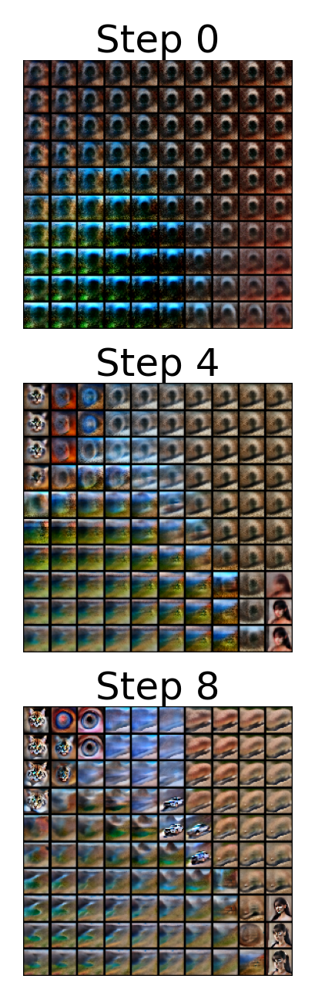
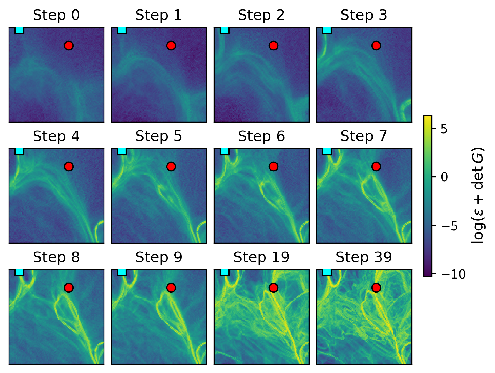

## Caffarelli Regularity and Hierarchical Phase Boundaries in Diffusion Model Latent Space

Accepted to NeurIPS 2025 ML4PS Workshop.

### Summary
We study phase-transition–like behavior in diffusion models through the Riemannian geometry of latent space induced by distances between CLIP embeddings. We observe a hierarchical emergence of phase boundaries: coarse boundaries appear early in denoising and finer ones emerge within them as sampling progresses. We approximate reverse diffusion as a discrete sequence of quadratic-cost optimal transport maps and, using Caffarelli–Figalli regularity theory, relate discontinuities of the generative map to mode-splitting. This yields a tree-like organization of modes and suggests an ultrametric structure for distances in this geometry.

### Figures
Side-by-side visualizations of a latent slice:

<p align="center">
  
  
  <!-- Left: grid of predicted noiseless images; Right: evolution of det of CLIP pullback metric -->
</p>

### Repo contents
- `generate_grid.py`: grid generation utilities for latent slices and metric estimation.
- `figures/`: key figures used in the paper.

### Citation

```
Lobashev, Guskov, Kawasaki-Borruat, Larchenko. "Caffarelli Regularity and Hierarchical Phase Boundaries in Diffusion Model Latent Space." NeurIPS 2025 ML4PS.
```


